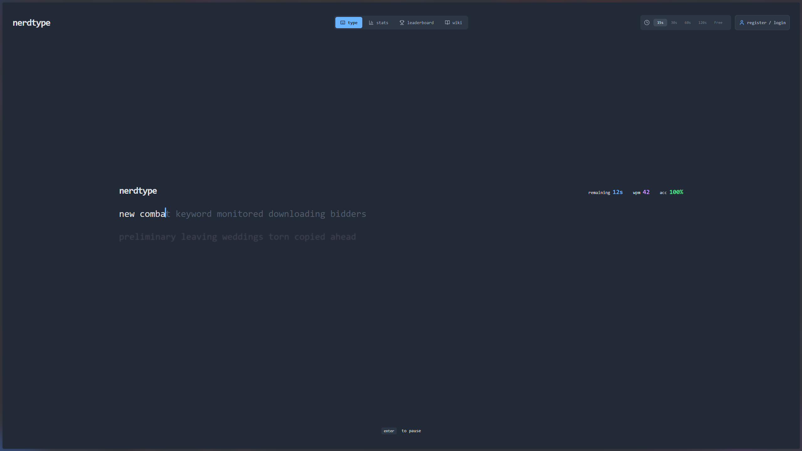
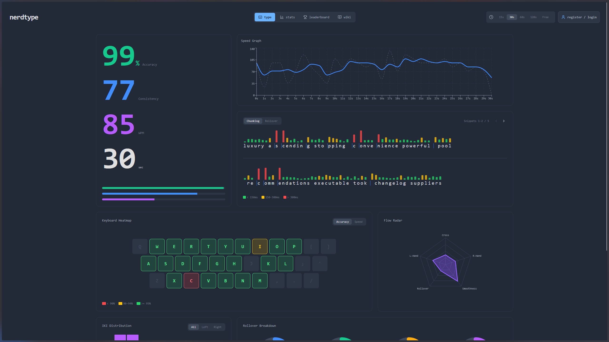
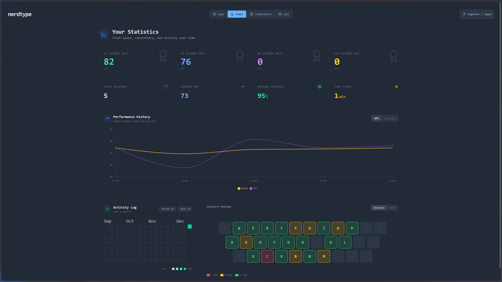
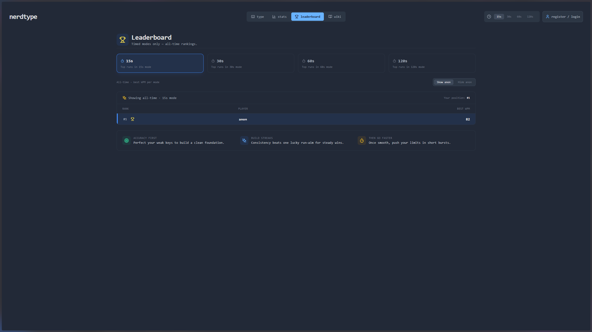
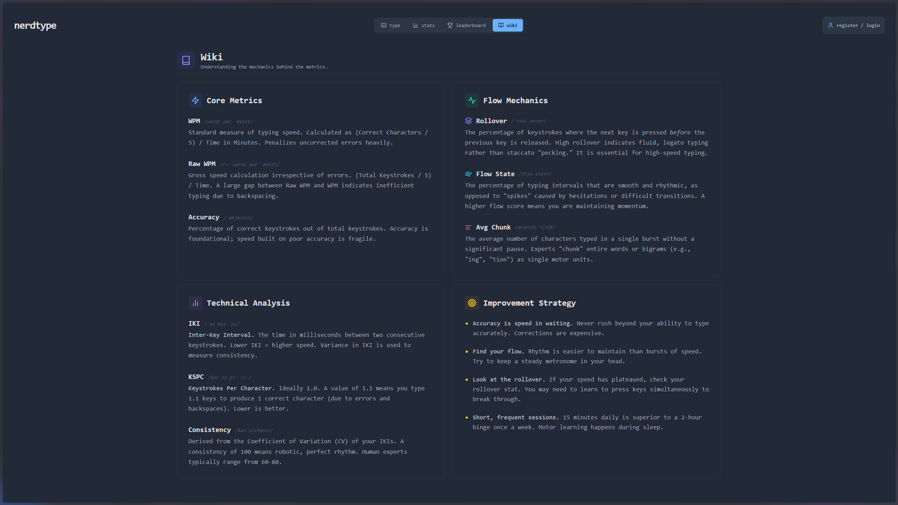

# NerdType

Adaptive typing practice with a contextual bandit, FAISS retrieval, and keystroke-level telemetry across WPM, accuracy, smoothness, and rollover.

NerdType is a personal research + product project exploring adaptive difficulty and motor-skill learning using real keystroke telemetry.

The system is intentionally **interpretability-first**, drawing from research in human motor learning and typing dynamics rather than opaque end-to-end models. Adaptation is driven by explicit, inspectable signals—inter-key intervals, rollover, chunking, and error dynamics—that are surfaced directly to both the user and the learning algorithm.

This design choice follows prior work showing that fine-grained keystroke timing contains rich, stable structure for modeling skill, learning, and cognition.

## Why NerdType?

**Traditional typing trainers** (Monkeytype, TypeRacer) are static:
- Same word lists for everyone
- No adaptation to your weaknesses
- WPM-only optimization (ignores typing quality)

**NerdType adapts to you:**
- Personalized snippet difficulty based on your skill profile
- Optimizes for motor learning: accuracy → smoothness → speed
- Exposes rich metrics (rollover, IKI variance, chunking) that reveal how you actually type
- Contextual bandit learns which text patterns challenge you productively

## Research foundations

NerdType’s metric design and adaptation loop are grounded in established research on typing dynamics, motor control, and keystroke timing:

- **Yin et al. (CHI 2018)** — *“How Do We Type? Movement Strategies and Performance in Everyday Typing”*  
  https://userinterfaces.aalto.fi/136Mkeystrokes/resources/chi-18-analysis.pdf  
  Large-scale analysis of **136 million keystrokes** from everyday typing.  
  Demonstrates that expert performance emerges from **rhythmic timing, rollover behavior, chunked motor plans, and reduced variance**, motivating NerdType’s emphasis on IKIs, rollover, chunk length, and smoothness rather than WPM alone.

- **Logan & Crump (2011)** — *“Hierarchical control of cognitive processes: The case for skilled typewriting”*  
  https://www.sciencedirect.com/science/chapter/bookseries/abs/pii/B9780123855275000012  
  Shows that expert typing is governed by **hierarchical motor programs**, not character-level cognition, directly motivating NerdType’s chunking, fluency, rollover, and per-hand metrics.

- **Killourhy & Maxion (2009)** — *“Comparing anomaly-detection algorithms for keystroke dynamics”*  
  https://ieeexplore.ieee.org/document/5270346  
  Establishes that **inter-key interval distributions and variance** are stable, information-rich signals, supporting the use of IKI CV and spike-rate as core smoothness metrics.

Together, these works motivate NerdType’s focus on **interpretable timing-based signals and bounded, incremental adaptation**, rather than black-box sequence models.

## Retrieval + decision architecture (two-tower + bandit)
- Two-tower setup: snippet tower (PCA to 16-dim) and user tower (130-dim state: EMA, variance, prev snippet). The LinTS bandit samples a weight matrix to map the user state to a query vector in snippet space.
- Retrieval: FAISS nearest neighbors on the sampled query vector, then light filtering (recent/current snippets) with probabilistic selection via softmax. Closer snippets get higher probability, but exploration is maintained through temperature control.
- Policy: The bandit learns which regions of snippet space to explore/exploit given the user embedding, effectively ranking snippets for the current motor-skill state. Two layers of stochasticity: Thompson sampling in query generation + softmax sampling in retrieval.

## Dimensionality control

Snippet embeddings are projected to **16 dimensions via PCA** before FAISS retrieval and bandit decisions.

**Explained variance (empirical):**
- 8 components → ~74%
- **16 components → ~97%**
- 32 components → ~100% (marginal)

Components beyond 16 contribute little signal and increase noise from rare n-grams.

**Why 16D**
The LinTS bandit learns a linear reward model over **user state × snippet embedding**. Higher dimensionality:
- Increases parameter count and posterior variance
- Requires more data to stabilize priors
- Destabilizes early Thompson sampling

Restricting to 16D:
- Bounds the hypothesis space
- Improves sample efficiency under sparse feedback
- Stabilizes posterior estimates during exploration

## User state

Users are represented by an explicit **130-dimensional state vector** capturing skill, stability, and recent difficulty context.

**State =**
- **57D EMA** — long-term skill baseline (speed, accuracy, smoothness, rollover, fluency)
- **57D stddev** — short-term variability (consistency / control)
- **16D previous snippet embedding** — recent difficulty context

**Why this structure**
- EMA + variance separates *skill* from *stability*
- Prevents overreaction to single sessions
- Previous snippet embedding reduces difficulty oscillation and enables smooth curriculum transitions

## Custom hierarchical reward / loss
- Custom hierarchical reward (in `app/ml/lints_agent.py`) balances accuracy, smoothness (IKI CV + spike rate), and effective WPM. Deltas are taken against the user’s EMA baselines and clipped to avoid runaway updates.
- Reward terms are layered: accuracy first, then accuracy × consistency, then accuracy × consistency × speed, scaled to keep gradients stable. This mirrors a task loss where correctness dominates, fluency refines, and speed is last-mile.
- The shape of the reward encourages smoother, lower-variance typing before pushing raw speed, aligning with the motor-learning goal instead of pure WPM leaderboard chasing.

### Hierarchical Reward Function

The bandit uses a hierarchical reward that prioritizes correctness and fluency before speed.
```
R = reward_scale * [ w1 * dA
                   + w2 * (dA * dC)
                   + w3 * (dA * dC * dS) ]
```

Where:
- `dA` = change in accuracy
- `dC` = change in consistency (smoothness)
- `dS` = change in effective WPM

All deltas are clipped against EMA baselines.

This multiplicative structure creates soft gating: low accuracy nullifies smoothness/speed rewards, preventing the model from optimizing speed at the cost of correctness.

**Defaults:**
- `w1 = 1.0`
- `w2 = 0.7`
- `w3 = 0.4`
- `reward_scale = 20`

## Headlines
- Metric-first typing surface: WPM, raw WPM, accuracy, smoothness (IKI CV + spike-rate), rollover, and per-hand fluency from every session.
- Contextual bandit (LinTS) steers snippet selection with a 16-dim embedding and a 130-dim user state (EMA + variance + previous snippet).
- Full keystroke telemetry feeds dashboards (speed series, replay events, heatmaps) and keeps the model reward grounded in user behavior.

## Screenshots
<br>

  
**Typing surface** — Adaptive snippet selection with real-time keystroke capture; every keydown/keyup feeds IKI, rollover, and chunking metrics used by the model.
<br>
<br>

  
**Session results** — Post-session breakdown of WPM vs raw WPM, accuracy, smoothness, rollover, and flow metrics derived directly from keystroke timing.
<br>
<br>

  
**Stats dashboard** — Longitudinal view of speed, accuracy, and fluency trends with EMA smoothing, enabling users to see exactly how the model perceives their skill over time.
<br>
<br>

  
**Leaderboard** — Mode-specific rankings with anonymized users supported; shows best WPMs tracked per timed mode.
<br>
<br>

  
**Wiki** — Reference view with key bindings, modes, and guidance to help users interpret the metrics.
<br>
<br>

## What the system does
- Serves adaptive typing snippets via FastAPI + FAISS, guided by a LinTS contextual bandit.
- Collects keystroke-by-keystroke telemetry to compute WPM, raw WPM, accuracy, smoothness, rollover, and fluency per hand/cross-hand.
- Updates user feature EMAs after each session and persists them to Postgres for cold-start recovery.
- Returns rich session analytics (speed timeline, replay events, heatmap) to the frontend for immediate feedback.

## Learning & decision-making
- **Bandit**: Diagonal Linear Thompson Sampling (`app/ml/lints_agent.py`) with hierarchical reward on accuracy, smoothness (IKI CV + spike rate), and effective WPM.
- **Embeddings**: 16-dim PCA snippet embeddings queried through FAISS (`app/ml/vector_store.py`), stored in Postgres and exported to on-disk index/metadata. 
- **User state**: 57-dim EMA + 57-dim stddev + previous snippet embedding → 130-dim context passed to the bandit.
- **Reward**: Baseline from EMA, deltas on accuracy/smoothness/eff. WPM scaled and clipped to avoid exploding updates.
- **Persistence**: Bandit weights saved to `app/ml/lints_model.pkl`; user feature EMA/variance persisted in the `User` row.

## Metrics we expose
- `wpm`, `rawWpm`, `accuracy`, `errors` per session.
- `smoothness` from global IKI CV and spike rate; `avgIki` and spike counts underneath.
- Rollover rates overall plus `rolloverL2L`, `rolloverR2R`, `rolloverCross`; fluency scores per hand (`leftFluency`, `rightFluency`, `crossFluency`).
- `kspc`, `avgChunkLength`, speed timeline (`speedSeries`), and replay events (`replayEvents`) with chunk boundaries and rollovers.
- Best WPMs tracked per timed mode (15/30/60/120s).

## How adaptation works
- Build user context: load EMA/stddev from Postgres (or zeros), include previous snippet embedding if available.
- Thompson sample bandit weights → query vector (16-dim) → FAISS search top-k.
- Filter out current + recent snippet ids; sample probabilistically from filtered candidates using softmax over distances (temperature=2.0).
- Return chosen snippet plus predicted WPM/accuracy/consistency from the EMA vector.
- After session: compute keystroke metrics, update EMA/variance, compute reward vs pre-session EMA, and update the bandit.

## Data & pipeline
- Postgres stores users, snippets (with embeddings), sessions, and keystroke events.
- Keystroke ingestion (`/api/sessions`) computes IKIs, spike rate, rollovers, transitions, and per-char stats via `UserFeatureExtractor`.
- FAISS index build: `python scripts/build_index.py --env dev` from `backend/` (uses snippet embeddings already in DB; stage/prod also supported). For first-time setup, run `python scripts/bootstrap_env.py --env dev` to generate snippets, populate the DB, and build the index in one pass.
- Snippet utilities live in `backend/scripts/` (seed data, init db, condense embeddings, etc.).

## Evaluation & correctness
- Reward grounded in deltas vs EMA baselines to avoid runaway difficulty; clip deltas to keep updates bounded.
- Smoothness and fluency come from raw IKIs and rollover detection (press before prior keyup) per session.
- Smoke tests: `cd backend && pytest` for retrieval and difficulty routines.
- Health check: `GET /api/health` and FastAPI docs at `/docs`.

## Observability
- **What we log today**: session ingestion stats (WPM, accuracy), rollout metrics (IKI CV, spike rate, rollover), and agent rewards on update paths.
- **What we would alert on**: high 5xx on `/sessions` or `/snippets/retrieve`, empty FAISS responses, reward collapse (nan/zero drift), spike-rate blowups, and long-tail latencies on snippet retrieval.
- **Product analytics**: Umami snippet in `frontend/index.html` (optional, self-hosted) for basic page views; expand to event-level later.

## API/type contracts (drift plan)
- Backend OpenAPI is the source of truth. Frontend TS types in `src/types` are maintained manually and reviewed alongside backend changes.
- To avoid drift: keep PRs that touch API schemas paired with TS type updates; rely on backend validation errors during dev builds.
- At scale: generate a typed client from OpenAPI (e.g., openapi-typescript) and gate merges on type checks.

## Running locally
- Prereqs: Python 3.11+, Node 20+, Postgres 15+.
- Backend:
  ```bash
  cd backend
  cp .env.example .env   # edit SECRET_KEY and DATABASE_URL if needed
  python -m venv .venv && source .venv/bin/activate
  pip install -r requirements.txt
  alembic upgrade head
  # One-shot bootstrap (generate → populate DB → build index)
  python scripts/bootstrap_env.py --env dev
  uvicorn app.main:app --host 0.0.0.0 --port 8000
  ```
- Frontend:
  ```bash
  cd frontend
  npm install
  VITE_API_URL=http://localhost:8000/api npm run dev -- --host
  ```
- Environment knobs: `DATABASE_URL`, `SECRET_KEY`, `FAISS_INDEX_PATH`/`SNIPPET_METADATA_PATH` (see `app/config.py`).

## Running via Docker
- **Dev** (default): `docker-compose up` → Frontend :5173, Backend :8000, DB :5432
- **Stage**: `docker-compose -f docker-compose.stage.yml up` → Frontend :5174, Backend :8001, DB :5433
- **Prod**: `docker-compose -f docker-compose.prod.yml up` → Frontend :5175, Backend :8002, DB :5434
- Each environment has isolated database and FAISS indices in `backend/data/{dev|stage|prod}/`
- First-time (fresh volume): after the stack is healthy, run migrations and bootstrap inside each backend container:
  - Dev: `docker-compose exec backend_dev alembic upgrade head && python scripts/bootstrap_env.py --env dev`
  - Stage: `docker-compose -f docker-compose.stage.yml exec backend_stage alembic upgrade head && python scripts/bootstrap_env.py --env stage`
  - Prod: `docker-compose -f docker-compose.prod.yml exec backend_prod alembic upgrade head && python scripts/bootstrap_env.py --env prod`

## Deployment and promotion
- See `docs/deployment.md` for full environment management guide
- **Dev → Stage**: `python backend/scripts/promote_to_stage.py` (validates + copies artifacts)
- **Stage → Prod**: `python backend/scripts/promote_to_prod.py` (requires manual confirmation)
- **Build index**: `python backend/scripts/build_index.py --env {dev|stage|prod}`
- Automatic backups created before each promotion; rollback documented in deployment guide

## Design principles
- Measurement before magic: every adaptation step is tied to observable keystroke metrics.
- Bounded exploration: Thompson sampling with minimum variance and clipped rewards.
- Fast feedback: per-session analytics (speed series, replay events) surface what the model sees.
- Resilient defaults: cold start uses neutral EMA baselines and filters recent snippets.

## FAQ
- **What happens if FAISS is empty?** We retry with a random vector; if still empty, return 404.
- **Where is state stored?** User EMA/variance in Postgres; bandit weights in `app/ml/lints_model.pkl`; FAISS index/metadata in `backend/data`.
- **How do I change snippet data?** Update rows in Postgres, then rerun `python scripts/build_index.py --env dev`.
- **How do I point the frontend elsewhere?** Set `VITE_API_URL` before `npm run dev/build`.

## Model & data lifecycle
- See `docs/model_lifecycle.md` for FAISS rebuilds, bandit state persistence, cold start defaults, and rollback guidance.

## Project structure
```
.
├── alembic.ini
├── backend
│   ├── alembic
│   │   ├── env.py
│   │   ├── README
│   │   ├── script.py.mako
│   │   └── versions
│   ├── alembic.ini
│   ├── app
│   │   ├── __init__.py
│   │   ├── config.py
│   │   ├── core
│   │   │   └── security.py
│   │   ├── database.py
│   │   ├── generator
│   │   │   ├── __init__.py
│   │   │   ├── build_ngrams.py
│   │   │   ├── config.py
│   │   │   ├── data
│   │   │   ├── enhance_wordlist.py
│   │   │   ├── generate.py
│   │   │   └── populate_db.py
│   │   ├── main.py
│   │   ├── ml
│   │   │   ├── __init__.py
│   │   │   ├── feature_aggregator.py
│   │   │   ├── lints_agent.py
│   │   │   ├── lints_model.pkl
│   │   │   ├── snippet_features.py
│   │   │   ├── snippet_pca_16.pkl
│   │   │   ├── user_features.py
│   │   │   └── vector_store.py
│   │   ├── models
│   │   │   ├── __init__.py
│   │   │   ├── db_models.py
│   │   │   └── schema.py
│   │   ├── routers
│   │   │   ├── __init__.py
│   │   │   ├── auth.py
│   │   │   ├── health.py
│   │   │   ├── profile_merge.py
│   │   │   ├── sessions.py
│   │   │   ├── snippets.py
│   │   │   └── users.py
│   │   └── utils
│   │       ├── __init__.py
│   │       ├── metrics.py
│   │       └── preprocessing.py
│   ├── data
│   │   ├── bigram_freqs.json
│   │   ├── english_10k.json
│   │   ├── english_10k_enriched.json
│   │   ├── faiss_index.bin
│   │   ├── snippet_metadata.json
│   │   ├── snippets.json
│   │   ├── trigram_freqs.json
│   │   └── word_features.json
│   ├── Dockerfile
│   ├── Dockerfile.train
│   ├── requirements.txt
│   └── scripts
│       ├── analyze_data.py
│       ├── bootstrap_env.py
│       ├── build_index.py
│       ├── cleanup_snippets.py
│       ├── condense_snippet_embeddings.py
│       ├── init_db.py
│       ├── promote_to_prod.py
│       ├── promote_to_stage.py
│       └── seed_data.py
├── docker-compose.yml
├── docs
│   ├── infra.md
│   └── model_lifecycle.md
├── frontend
│   ├── Dockerfile
│   ├── Dockerfile.dev
│   ├── index.html
│   ├── package-lock.json
│   ├── package.json
│   ├── postcss.config.js
│   ├── public
│   ├── src
│   │   ├── api
│   │   │   └── client.ts
│   │   ├── App.tsx
│   │   ├── components
│   │   │   ├── AuthModal.tsx
│   │   │   ├── dashboard
│   │   │   │   ├── FlowRadar.tsx
│   │   │   │   ├── IkiHistogramWidget.tsx
│   │   │   │   ├── KeyboardHeatmap.tsx
│   │   │   │   ├── ReplayChunkStrip.tsx
│   │   │   │   ├── ResultsDashboard.tsx
│   │   │   │   ├── RolloverBreakdown.tsx
│   │   │   │   ├── SessionStatsWidget.tsx
│   │   │   │   ├── SkillBars.tsx
│   │   │   │   └── SpeedGraph.tsx
│   │   │   ├── Header.tsx
│   │   │   ├── TypingZone.tsx
│   │   │   ├── TypingZoneStatsDisplay.tsx
│   │   │   └── UserMenu.tsx
│   │   ├── context
│   │   │   ├── AuthContext.tsx
│   │   │   └── SessionModeContext.tsx
│   │   ├── hooks
│   │   │   ├── useKeystrokeTracking.ts
│   │   │   ├── useTypingSession.ts
│   │   │   └── useWPMCalculation.ts
│   │   ├── index.css
│   │   ├── main.tsx
│   │   ├── pages
│   │   │   ├── AuthPage.tsx
│   │   │   ├── ChangePasswordPage.tsx
│   │   │   ├── ChangeUsernamePage.tsx
│   │   │   ├── DeleteAccountPage.tsx
│   │   │   ├── LeaderboardPage.tsx
│   │   │   ├── StatsPage.tsx
│   │   │   └── WikiPage.tsx
│   │   ├── types
│   │   │   ├── index.ts
│   │   │   └── react-calendar-heatmap.d.ts
│   │   └── utils
│   │       ├── anonymousUser.ts
│   │       ├── canvas.ts
│   │       └── storage.ts
│   ├── tailwind.config.js
│   ├── tsconfig.json
│   ├── tsconfig.node.json
│   └── vite.config.ts
├── README.md
└── screenshots
  ├── results.png
  ├── stats.png
  └── type.png
```

## Contributing

Contributions welcome! Please fork, create a feature branch, and submit a PR.
