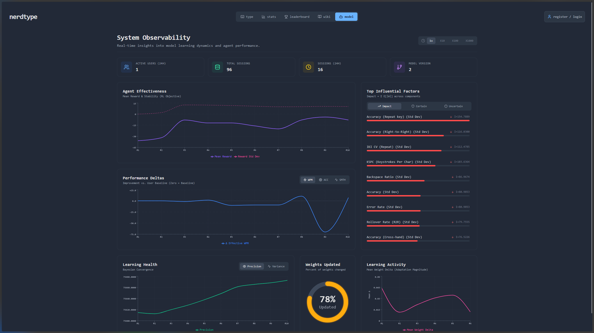

# Model & Data Lifecycle

## Components
- **Snippet embeddings**: 16-dim PCA in Postgres (`snippets.processed_embedding`)
- **FAISS index + metadata**: stored in MinIO/S3 buckets (`flowtype-{dev|stage|prod}`) and mirrored on disk at `data/{env}/faiss_index.bin` + `snippet_metadata.json`
- **Offline artifacts**: word lists + n-grams replicated in the shared `flowtype-offline` bucket for bootstrap runs
- **Bandit weights**: `app/ml/lints_model.pkl` (Thompson Sampling posteriors)

## Build flows
```bash
# Seed snippets → DB, compute embeddings
python -m scripts.init_db
python -m scripts.seed_data

# Build FAISS for specific env
python scripts/build_index.py --env dev
```

Before promoting to another environment, sync artifacts to MinIO via `python backend/scripts/migrate_data_to_minio.py` and ensure the target stack's MinIO endpoint is online.

## When to rebuild FAISS
- Snippet embeddings added/changed/deleted
- PCA model updated (re-run embedding pipeline)
- Bulk cleanup invalidates existing IDs

## Promotion
```bash
# Dev → Stage (validates + backs up)
python scripts/promote_to_stage.py

# Stage → Prod (requires confirmation)
python scripts/promote_to_prod.py
```

Both scripts stream artifacts through MinIO/S3 (`flowtype-stage` → `flowtype-prod`) with automatic backups in the destination bucket. They require the corresponding MinIO endpoint to be reachable.

**Validation on promotion:**
- FAISS loads, vector count matches metadata count
- Metadata has required fields (id, words, difficulty)
- Auto-backup to `{env}/backup/` before overwrite

## Rollback
```bash
# Restore from backup
cd backend/data/{stage|prod}
cp backup/faiss_index.bin.bak faiss_index.bin
cp backup/snippet_metadata.json.bak snippet_metadata.json

# Restart service
docker-compose -f docker-compose.{env}.yml restart backend_{env}
```

## Bandit state
- Auto-persisted to `lints_model.pkl` on every update
- Cold start: neutral priors if missing
- Back up before major changes to preserve explore/exploit balance

## Validation checklist
- FAISS index dimension = 16
- `POST /api/snippets/retrieve` returns results
- Rewards finite after session (no NaN/inf)
- All active snippets have embeddings

## Observability signals
- Track the `/observability` dashboard post-promotion to confirm certainty/uncertainty bands and reward deltas stabilize with fresh data.
- Validate session ingest latency and error rates in container logs; anomalies often indicate MinIO buckets missing artifacts.
- Screenshot reference: 
